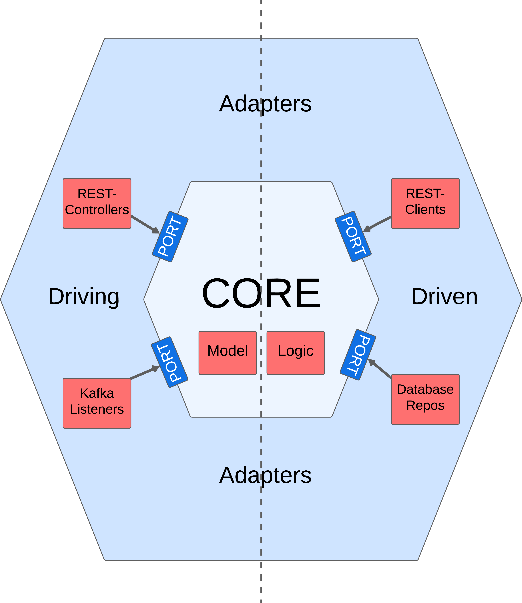

# Hexagonal Architecture in Spring Boot and Java

This repo shows a simple setup for an Hexagonal Architecture using Spring Boot and Java as shown in my [Youtube video](https://youtu.be/J0etq6clvfw).



## Starting up this application

The `infra/` directory contains a `docker-compose.yaml` file that sets up a PostgreSQL database for local testing.
Simple navigate into the directory and start up the container like this:

```bash
cd infra/
docker compose up
```

In a second terminal, you can now start up the Spring Boot application like this:

```bash
./mvnw spring-boot:run
```